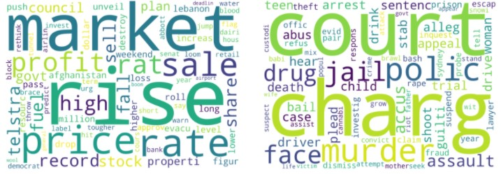
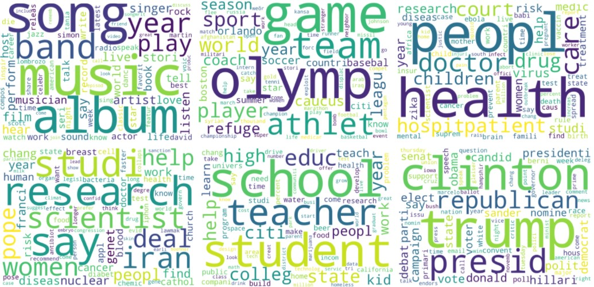

# Topic-Modeling-and-Document-Categorization-using-Latent-Dirichlet-Allocation
Categorize documents per topics inferred by LDA approach

# Description
This project classifies text (news headlines or Facebook posts) into overarching themes which are determined by the Latent Dirichlet Allocation algorithm.

In machine learning, a topic model is specifically defined as a natural language processing technique used to discover hidden semantic structures of text in a collection of documents, usually called corpus. In general, each document refers to a continuous set of words, like a paragraph or an article, where each article contains a set of words.

Latent Dirichlet Allocation (LDA) is an unsupervised machine learning approach used to classify text in a document to a particular topic.

For that purpose, it builds a topic per document model and words per topic model, modeled as Dirichlet distributions.
Each document is modeled as a multinomial distribution of topics and each topic is modeled as a multinomial distribution of words.
LDA assumes that the every chunk of text we feed into it will contain words that are somehow related. Words will allow us to categorize each document to a particular topic or a theme. Therefore choosing the right corpus of data is crucial. It also assumes documents are produced from a mixture of topics. Those topics then generate words based on their probability distribution.

# Dataset

I used two separate datasets to test the model.
- The first dataset we’ll use is a list of over one million news headlines published over a period of 15 years and can be downloaded from [Kaggle](https://www.kaggle.com/therohk/million-headlines/data). It is also provided as a zip file in this repo.
- The second dataset is a collection of over 36,000 posts on US Presidential Election dealing with the topic of [What Engaged People on Facebook](https://github.com/milkha/FBElec16). The dataset is composed of Facebook posts published by major news organizations (TV, Radio, Press) in the 10-month period leading to the 2016 presidential election. For this project, I used the posts coming from NPR organization (National Public Radio). The dataset can be found [here](https://github.com/milkha/FBElec16/blob/master/data/npr.csv) and is also available in the repo.

Two separate notebooks are provided in the repo, one for each of the datasets.

# LDA

There are two hyperparameters that control document and topic similarity, known as alpha and beta, respectively. A low value of alpha will assign fewer topics to each document whereas a high value of alpha will have the opposite effect. A low value of beta will use fewer words to model a topic whereas a high value will use more words, thus making topics more similar between them.

A third hyperparameter has to be set when implementing LDA, namely, the number of topics the algorithm will detect since LDA cannot decide on the number of topics by itself.

The output of the algorithm is a vector that contains the coverage of every topic for the document being modeled. It will look something like this [0.2, 0.5, etc.] where the first value shows the coverage of the first topic, and so on. If compared appropriately, these vectors can give you insights into the topical characteristics of your corpus.

For more information on how those probabilities are computed, the statistical distributions assumed by the algorithm, or how to implement LDA, you can refer to [the original LDA paper](http://www.jmlr.org/papers/volume3/blei03a/blei03a.pdf).

# Approach

Data processing is crucial. We perform the following steps:
- Tokenization: Split the text into sentences and the sentences into words. Lowercase the words and remove punctuation.
- Words that have fewer than 3 characters are removed.
- All stopwords are removed.
- Words are lemmatized — words in third person are changed to first person and verbs in past and future tenses are changed into present.
- Words are stemmed — words are reduced to their root form.

Later, while producing bag of words, we retain in our vocabulary only the words with at least 15 occurences (rare words eliminated) and eliminate extremely frequent words (occurence at least 10% of the corpus size). Td-Idf is also performed and both preprocessed corpus are used to fit LDA models.

gensim and nltk librairies are used in the project.

# Results

The categorization using the dataset of Facebook posts is extremely convincing with clear, delimited and disjoint topic spheres. See illustration below on a few examples.
This could be explained by the higher quality and greater length of the text pieces (posts vs headlines) giving the model better materials to extract features from words.
The topics are also clearer using tf-idf weighting technique.
This certainly confirms that the consistency and quality of the input texts have a strong impact of the quality of the output. Texts sharing similar editorial rules (coming from the same organization, company or other body) and focusing on single topics at a time will likely perform very well.

The allocation of unseen text to the determined topics is also very good.

