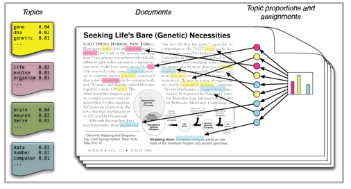
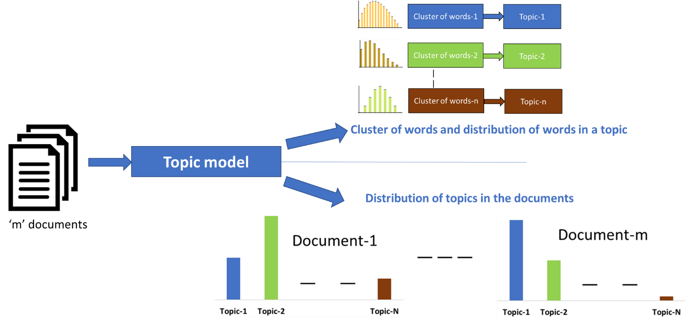
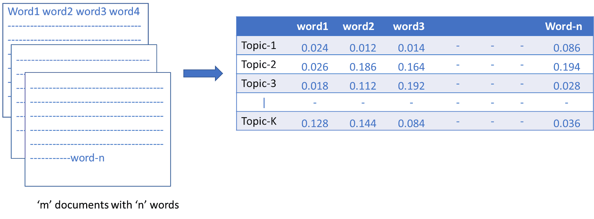
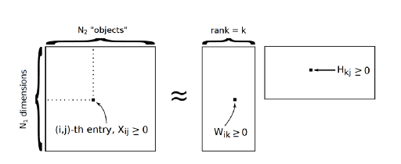

# Topic-Modeling-and-Document-Categorization-using-Latent-Dirichlet-Allocation
Categorize documents per topics inferred by LDA approach

# Description
This project classifies text (news headlines or Facebook posts) into overarching themes which are determined by the Latent Dirichlet Allocation algorithm.

In machine learning, a topic model is specifically defined as a natural language processing technique used to discover hidden semantic structures of text in a collection of documents, usually called corpus. In general, each document refers to a continuous set of words, like a paragraph or an article, where each article contains a set of words. Topic Modeling is the process to automatically identify topics present in a text object and to derive hidden patterns exhibited by a text corpus. It is an unsupervised approach used for finding and observing the bunch of words (called “topics”) in large clusters of texts. Topics can be defined as “a repeating pattern of co-occurring terms in a corpus”, like Healthcare would be with words like "doctors", "health", "medicine", "patient", "hospital",...Topic Models are very useful for the purpose for document clustering, organizing large blocks of textual data, information retrieval from unstructured text and feature selection.

Latent Dirichlet Allocation (LDA) is the unsupervised machine learning approach used to classify text in a document to a particular topic.

For that purpose, it builds a topic per document model and words per topic model, modeled as Dirichlet distributions.
Each document is modeled as a multinomial distribution of topics and each topic is modeled as a multinomial distribution of words.
LDA assumes that the every chunk of text we feed into it will contain words that are somehow related. Words will allow us to categorize each document to a particular topic or a theme. Therefore choosing the right corpus of data is crucial. It also assumes documents are produced from a mixture of topics. Those topics then generate words based on their probability distribution.

# Dataset

I used two separate datasets to test the model.
- The first dataset we’ll use is a list of over one million news headlines published over a period of 15 years and can be downloaded from [Kaggle](https://www.kaggle.com/therohk/million-headlines/data). It is also provided as a zip file in this repo.
- The second dataset is a collection of over 36,000 posts on US Presidential Election dealing with the topic of [What Engaged People on Facebook](https://github.com/milkha/FBElec16). The dataset is composed of Facebook posts published by major news organizations (TV, Radio, Press) in the 10-month period leading to the 2016 presidential election. For this project, I used the posts coming from NPR organization (National Public Radio). The dataset can be found [here](https://github.com/milkha/FBElec16/blob/master/data/npr.csv) and is also available in the repo.

Two separate notebooks are provided in the repo, one for each of the datasets.

# LDA

Latent means hidden, Dirichlet is a type of probability distribution. Latent Dirichlet Allocation means that we are trying to find all the probability distributions and they are hidden. Let’s break this name down to see what it means:

- First, the topics are unseen, unobserved. In other words, the model looks at a bunch of documents and tries to figure out the topics that best explain where those documents come from. This is what latent means: the topics are hypothesized.
- Second, Dirichlet is a kind of probability distribution. So this just refers to the specific type of probability distribution that is being used to estimate the prior probability of each unseen topic. What is a prior probability? Think about it this way: we’re trying to guess which topics best describe the data set. For each document we look at, we have our current best guess. Then, we update our guess based on what we find. So, the Dirichlet is the specific probability distribution that we use to represent our current best guess about topics.
- Third, allocation means that we’re trying to spread words around into the topics they belong to. What is the probability that “smog” or “record high” are a part of the CLIMATE topic? This allocation is similar to dimension reduction (if you are familiar with principal components analysis): which words can be joined together to form a single topic, where the aggregate topic is more meaningful than the individual words that make it up?

So Topic modeling and document categorization can be summarized in two steps:
- identify the distribution of to-be-determined topics in the documents analyzed
- identify the distribution of words or cluster of words in these topics

                

In other simple words, we want LDA to learn the topic mix in each document and the word mix in each topic.
- Choose the number of topics we think there are in the entire data set (example: num_topics = 2).
- Randomly assign each word in each document to one of two topics (example: the word “football” is randomly assigned to Topic B which is politics-like topic)
- Go through every word and its topic assignment in each document. Look at 1) how often the topic occurs in the doc and 2) how often the word occurs in the topic overall. Based on this information, assign the word a new topic (example: it looks like “football” does not occur often in Topic B, so the word “football” probably should be assigned to Topic A).
- Go through multiple iteration of this. Eventually the topics will start making sense in a way that we could interpret them and give them themes.

Latent Dirichlet Allocation is fundamentally factorizing the Bag of Words matrix [documents x vocabulary (all the unique words) with aij being the occurence] into two smaller matrices. One representing the documents x the topics and one representing the topics x the vocabulary of words. This matrix factorization is illustrated below. Those matrices are associated with two Dirichlet distributions.
- Distribution alpha will tell us what documents are associated with the topics (topic per document model).
- Distribution beta will tell us what words are associated with these topics (words per topic model).

There are two hyperparameters that control document and topic similarity, known as alpha and beta, respectively. A low value of alpha will assign fewer topics to each document whereas a high value of alpha will have the opposite effect. A low value of beta will use fewer words to model a topic whereas a high value will use more words, thus making topics more similar between them.

A third hyperparameter has to be set when implementing LDA, namely, the number of topics the algorithm will detect since LDA cannot decide on the number of topics by itself.

The output of the algorithm is a vector that contains the coverage of every topic for the document being modeled. It will look something like this [0.2, 0.5, etc.] where the first value shows the coverage of the first topic, and so on. If compared appropriately, these vectors can give you insights into the topical characteristics of your corpus.

For more information on how those probabilities are computed, the statistical distributions assumed by the algorithm, or how to implement LDA, you can refer to [the original LDA paper](http://www.jmlr.org/papers/volume3/blei03a/blei03a.pdf).

# Approach

Data processing is crucial. We perform the following steps:
- Tokenization: Split the text into sentences and the sentences into words. Lowercase the words and remove punctuation.
- Words that have fewer than 3 characters are removed.
- All stopwords are removed.
- Words are lemmatized — words in third person are changed to first person and verbs in past and future tenses are changed into present.
- Words are stemmed — words are reduced to their root form.

Later, while producing bag of words, we retain in our vocabulary only the words with at least 15 occurences (rare words eliminated) and eliminate extremely frequent words (occurence at least 10% of the corpus size). Td-Idf is also performed and both preprocessed corpus are used to fit LDA models.

gensim and nltk librairies are used in the project.

# Results

The categorization using the dataset of Facebook posts is extremely convincing with clear, delimited and disjoint topic spheres. See illustration below on a few examples.
This could be explained by the higher quality and greater length of the text pieces (posts vs headlines) giving the model better materials to extract features from words.
The topics are also clearer using tf-idf weighting technique.

This certainly confirms that the consistency and quality of the input texts have a strong impact of the quality of the output. Texts sharing similar editorial rules (coming from the same organization, company or other body) and focusing on single topics at a time will likely perform very well.

The allocation of unseen text to the determined topics is also very good.

